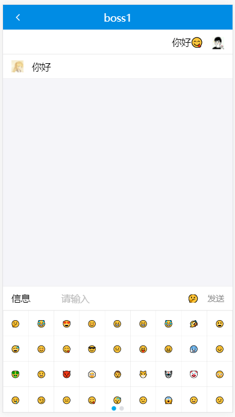

## 学习开发一款求职聊天web app

### 预览

在线预览地址： [在线访问请点这里](http://47.100.178.237/login)，浏览器点开后按f12用手机模式预览（chrome浏览器点击开发者工具面板左上角第二个图标）

角色分为求职者（牛人）和招聘者（boss）。注册后选择求职者需要完善求职的岗位信息，招聘者需要完善需要招聘人才的技能要求。然后就可以在列表中查看，并且可以实时聊天。目前注册有4个账号(你也可以自己注册账号来测试)分别为：
- kain 密码：123    （求职者）
- genuis 密码：123  （求职者）
- boss 密码：123    （招聘者）
- boss1 密码：123   （招聘者）

### 页面
- 用户中心
- 牛人
- BOSS
- 登录
- 求职注册
- 管理职位
- 注册
- 职位列表
- 查看牛人
- 信息完善
- 聊天

### 目录介绍

```$xslt
applyjob
|-build          // 执行build命令后的目录，是src压缩优化处理后的代码，上线运行
|-config         // webpack配置目录
|-node_modules   // npm包存放的目录
|-public         // 放公共资源静态文件
|-scripts        // npm脚本执行的文件目录
|-server         // 服务端目录
|---model.js     // mongodb数据库建立模型文件
|---server.js    // 服务端启动入口文件
|---user.js      // 用户操作对应的数据库操作文件
|-src            // 前端目录
|---component    // 组件目录
|---contsiner    // 路由页面陆慕
|---redux        // redux文件目录
|---app.js       
|-.babelrc       // babel配置文件
|-.gitignore     // git配置文件
|-package.json
|-package-lock.json
+README.md
```

### 截图

- 聊天界面


### 技术栈

- react16: 实现前端页面构建
- redux: 实现不同组件间的状态共享
- react-router-dom: 实现路由管理
- socket.io: 实现实时消息推送
- axios: 一个基于 ***Promise*** 的 HTTP 库，向后端发起请求
- express:  服务端node.js框架
- ES6: 客户端均使用ES6语法，promise/async/await 处理异步
- Webpack: 模块打包，前端项目构建工具
- Ant Design Mobile: 此项目写的css很少，基本上用的蚂蚁金服的这个开源库
- mongodb: 后端数据库
- pm2: 服务端使用pm2部署，常驻进程，也可以用forever[https://github.com/Unitech/pm2](https://github.com/Unitech/pm2)

### 本地运行
1. 安装node.js,我用的是windows 8.9.3版
2. 安装npm,版本不要太低（>4）
3. 安装mongodb
4. 本地电脑控制台执行：git clone https://github.com/wksmile/applyjob.git
5. applyjob工程目录，执行： npm install

#### 执行
- npm run start 通过前端访问：[127.0.0.1:3000](127.0.0.1:3000)
- npm run build 构架项目，压缩优化
- npm run server_bak 用nodemon运行项目，后端改变可以自动重启，通过服务端访问[127.0.0.1](127.0.0.1)，已设为80端口，若占用在 server/server.js中换端口号
- npm run server_pm2 用pm2运行项目，部署到服务端就运行

### FAQ

若使用的过程中遇到问题，可以加我的qq联系:415893570。

如果觉得可以就毫不吝啬地给个star吧。